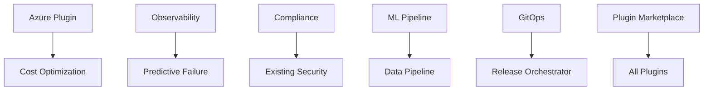

# Strategic Analysis: Claude Code Plugin Ecosystem

## Executive Summary

This analysis examines the Claude Code plugin ecosystem, which currently comprises **13 plugins**, **112+ skills**, **95 slash commands**, **21 workflows**, **221+ agents**, and **10 MCP servers**. The ecosystem demonstrates sophisticated multi-agent orchestration with a **93.3% context reduction** through lazy-loading registry architecture.

### Key Findings

1. **Strengths**: Mature Jira integration (35 commands), sophisticated multi-agent deliberation, comprehensive testing orchestration, robust code quality gates
2. **Critical Gaps**: No native Azure support, limited observability/monitoring plugins, missing data pipeline orchestration, no API gateway management
3. **High-Value Opportunities**: AI/ML pipeline orchestration, cost optimization automation, compliance automation, cross-platform mobile orchestration
4. **Strategic Recommendations**: 10 new plugins identified, 8 major improvements to existing plugins, 5 architecture enhancements

---

## Part 1: Gap Analysis

### 1.1 Technology Coverage Gaps

#### Cloud Platforms (CRITICAL)
| Platform | Current State | Gap Severity |
|----------|---------------|--------------|
| AWS | Basic skill coverage (S3, EC2, Lambda, EKS) | Medium |
| GCP | Basic skill coverage (Cloud Run, BigQuery, GKE) | Medium |
| **Azure** | **NO COVERAGE** | **Critical** |
| Vercel | Full MCP integration | Complete |

**Impact**: Azure represents 23% of cloud market share. Organizations using Azure cannot leverage the orchestration system effectively.

#### Infrastructure & DevOps Gaps
| Tool/Platform | Current State | Gap |
|---------------|---------------|-----|
| Terraform | Skill only, no plugin | Missing orchestration, state management, drift detection |
| Ansible | Single agent | No playbook orchestration, inventory management |
| Pulumi | Not covered | Missing entirely (IaC alternative) |
| ArgoCD/FluxCD | Not covered | GitOps workflows missing |
| Istio/Service Mesh | Not covered | No service mesh management |
| Vault/Secrets Management | Basic command only | No full HSM/PKI orchestration |

#### Observability & Monitoring (SIGNIFICANT GAP)
| Tool | Status |
|------|--------|
| Prometheus/Grafana | Not covered |
| DataDog | Not covered |
| New Relic | Not covered |
| ELK Stack | Not covered |
| Jaeger/Zipkin (Tracing) | Not covered |
| OpenTelemetry | Not covered |

**Impact**: No automated monitoring setup, alert management, or observability pipeline orchestration.

#### Data Engineering Gaps
| Capability | Status |
|------------|--------|
| Apache Airflow | Not covered |
| dbt (data build tool) | Not covered |
| Apache Spark | Not covered |
| Snowflake | Not covered |
| Data Catalog/Lineage | Not covered |
| ETL/ELT Orchestration | Basic workflow only |

#### API & Integration Gaps
| Capability | Status |
|------------|--------|
| Kong/API Gateway | Not covered |
| OAuth Server Management | Partial (Keycloak only) |
| OpenAPI Code Generation | Basic MCP generator |
| gRPC | Not covered |
| AsyncAPI | Not covered |
| Event-Driven Architecture | Kafka/RabbitMQ agents only, no orchestrator |

### 1.2 Workflow Automation Gaps

| Missing Workflow | Description | Impact |
|------------------|-------------|--------|
| Rollback Orchestration | Automated rollback with health checks | High - manual rollbacks are error-prone |
| Blue/Green Deployment | Coordinated blue/green switching | High - missing safe deployment pattern |
| Canary Deployment | Progressive rollout orchestration | High - missing gradual release |
| Database Migration Pipeline | Multi-environment migration with validation | Medium - error-prone migrations |
| Compliance Workflow | SOC2/GDPR/HIPAA compliance automation | High - manual compliance costly |
| Cost Optimization | Cloud cost analysis and right-sizing | Medium - cost waste |
| Chaos Engineering | Controlled chaos experiment orchestration | Low - advanced capability |

### 1.3 Developer Experience Gaps

| Gap | Description |
|-----|-------------|
| IDE Plugin Ecosystem | No VS Code extension marketplace integration |
| Local Development | No local dev environment orchestration (Docker Compose, Skaffold) |
| Hot Reload Integration | No live reload orchestration for development |
| Monorepo Tooling | No Nx/Turborepo/Lerna orchestration |
| Code Generation | Limited scaffolding beyond archetypes |
| Dependency Resolution | No automated dependency conflict resolution |

### 1.4 Security & Compliance Gaps

| Gap | Severity |
|-----|----------|
| SAST/DAST Orchestration | Medium - security scanning exists but not orchestrated |
| Compliance Automation | High - SOC2, HIPAA, GDPR manual |
| Security Incident Response | Medium - incident workflow exists but no security focus |
| Penetration Testing | High - no automated pen test orchestration |
| Security Training | Low - no security awareness automation |
| Audit Trail | Medium - basic logging, no compliance-grade audit |

### 1.5 AI/ML Capabilities Gaps

| Gap | Description |
|-----|-------------|
| ML Pipeline Orchestration | No MLflow/Kubeflow/SageMaker integration |
| Model Registry | No model versioning/registry |
| Feature Store | No feature engineering orchestration |
| A/B Testing | No experimentation platform integration |
| Model Monitoring | No drift detection or model observability |
| LLMOps | No LLM-specific operations (fine-tuning, evaluation) |

---

## Part 2: Opportunity Matrix

### 2.1 High-Value Opportunities

| Opportunity | Value | Effort | ROI Score |
|-------------|-------|--------|-----------|
| Azure Orchestrator Plugin | Very High | Medium | 9/10 |
| Observability Orchestrator | High | Medium | 8/10 |
| ML Pipeline Orchestrator | Very High | High | 8/10 |
| Cost Optimization Plugin | High | Low | 9/10 |
| Compliance Automation Plugin | Very High | Medium | 9/10 |
| API Gateway Orchestrator | Medium | Low | 8/10 |
| GitOps Orchestrator | High | Medium | 8/10 |
| Data Pipeline Orchestrator | High | High | 7/10 |
| Mobile DevOps Plugin | Medium | Medium | 7/10 |
| Monorepo Orchestrator | Medium | Low | 8/10 |

### 2.2 Cross-Plugin Synergy Opportunities

| Synergy | Plugins Involved | Benefit |
|---------|------------------|---------|
| Security + Compliance | code-quality-orchestrator + (new) compliance-plugin | Unified security posture |
| Testing + Quality | testing-orchestrator + code-quality-orchestrator | Integrated quality gates |
| Jira + All Plugins | jira-orchestrator + * | Full lifecycle tracking |
| Cost + Cloud | (new) cost-plugin + aws/gcp/azure | Cost-aware deployments |
| ML + Data | (new) ml-orchestrator + (new) data-orchestrator | End-to-end ML pipelines |

### 2.3 Emerging Technology Opportunities

| Technology | Opportunity | Timeline |
|------------|-------------|----------|
| WebAssembly | WASM deployment orchestration | 6-12 months |
| Edge Computing | Edge deployment orchestration | 6-12 months |
| Serverless v2 | Advanced serverless patterns (step functions) | 3-6 months |
| AI Agents | Agent-to-agent protocol (A2A) | 12-18 months |
| Quantum Computing | Quantum algorithm testing | 18-24 months |

### 2.4 Automation Multipliers

| Automation | Current State | Enhancement Potential |
|------------|---------------|----------------------|
| Self-Healing Infrastructure | Not implemented | Very High |
| Auto-Scaling Orchestration | Basic command | High |
| Intelligent Retry Logic | Partial | Medium |
| Predictive Failure Prevention | Plugin exists, not integrated | Very High |
| Context-Aware Routing | Implemented | Enhance with ML |

---

## Part 3: Strategic Recommendations

### 3.1 NEW PLUGINS (Prioritized)

#### Priority 1: Azure Orchestrator Plugin
**Callsign**: "Nebula"
**Faction**: Forerunner
**Justification**: Fills critical cloud gap (23% market share)

```json
{
  "name": "azure-orchestrator",
  "provides": {
    "commands": 25,
    "agents": 10,
    "skills": 8,
    "workflows": 6
  },
  "capabilities": [
    "AKS cluster management",
    "Azure DevOps integration",
    "Azure Functions orchestration",
    "Cosmos DB operations",
    "Azure AD/Entra integration",
    "ARM template management",
    "Azure Monitor integration"
  ],
  "priority": "critical",
  "effort": "medium",
  "timeline": "Q1 2025"
}
```

#### Priority 2: Observability Orchestrator Plugin
**Callsign**: "Watcher"
**Faction**: Forerunner
**Justification**: Critical operational capability gap

```json
{
  "name": "observability-orchestrator",
  "provides": {
    "commands": 20,
    "agents": 12,
    "skills": 6,
    "workflows": 5
  },
  "capabilities": [
    "Prometheus/Grafana setup",
    "Alert management",
    "Dashboard generation",
    "Log aggregation (ELK)",
    "Distributed tracing (Jaeger)",
    "SLO/SLA management",
    "Incident correlation"
  ],
  "integrations": ["predictive-failure-engine"],
  "priority": "high",
  "effort": "medium",
  "timeline": "Q1 2025"
}
```

#### Priority 3: Compliance Orchestrator Plugin
**Callsign**: "Sentinel"
**Faction**: Forerunner
**Justification**: High-value enterprise requirement

```json
{
  "name": "compliance-orchestrator",
  "provides": {
    "commands": 18,
    "agents": 8,
    "skills": 10,
    "workflows": 8
  },
  "capabilities": [
    "SOC2 compliance automation",
    "GDPR data mapping",
    "HIPAA safeguard verification",
    "PCI-DSS scanning",
    "Audit trail generation",
    "Evidence collection",
    "Policy enforcement"
  ],
  "integrations": ["code-quality-orchestrator", "testing-orchestrator"],
  "priority": "high",
  "effort": "medium",
  "timeline": "Q1 2025"
}
```

#### Priority 4: Cost Optimization Plugin
**Callsign**: "Economist"
**Faction**: Forerunner
**Justification**: High ROI, low effort

```json
{
  "name": "cost-optimization-orchestrator",
  "provides": {
    "commands": 15,
    "agents": 6,
    "skills": 5,
    "workflows": 4
  },
  "capabilities": [
    "Cloud cost analysis",
    "Resource right-sizing recommendations",
    "Reserved instance optimization",
    "Spot instance orchestration",
    "Cost allocation tagging",
    "Budget alerting",
    "Cost anomaly detection"
  ],
  "integrations": ["aws skill", "gcp skill", "azure-orchestrator"],
  "priority": "high",
  "effort": "low",
  "timeline": "Q2 2025"
}
```

#### Priority 5: ML Pipeline Orchestrator Plugin
**Callsign**: "Oracle"
**Faction**: Forerunner
**Justification**: AI/ML is strategic growth area

```json
{
  "name": "ml-pipeline-orchestrator",
  "provides": {
    "commands": 22,
    "agents": 14,
    "skills": 10,
    "workflows": 7
  },
  "capabilities": [
    "MLflow integration",
    "Kubeflow orchestration",
    "SageMaker pipeline management",
    "Model registry operations",
    "Feature store management",
    "Experiment tracking",
    "Model deployment automation",
    "A/B testing orchestration",
    "Model monitoring setup"
  ],
  "integrations": ["testing-orchestrator", "predictive-failure-engine"],
  "priority": "high",
  "effort": "high",
  "timeline": "Q2 2025"
}
```

#### Priority 6: GitOps Orchestrator Plugin
**Callsign**: "Shepherd"
**Faction**: Forerunner
**Justification**: Modern deployment paradigm gap

```json
{
  "name": "gitops-orchestrator",
  "provides": {
    "commands": 16,
    "agents": 8,
    "skills": 6,
    "workflows": 5
  },
  "capabilities": [
    "ArgoCD management",
    "FluxCD integration",
    "GitOps workflow setup",
    "Multi-cluster deployment",
    "Drift detection",
    "Automated sync",
    "Rollback orchestration"
  ],
  "integrations": ["git-workflow-orchestrator", "release-orchestrator"],
  "priority": "medium",
  "effort": "medium",
  "timeline": "Q2 2025"
}
```

#### Priority 7: Data Pipeline Orchestrator Plugin
**Callsign**: "Conduit"
**Faction**: Forerunner
**Justification**: Data engineering capability gap

```json
{
  "name": "data-pipeline-orchestrator",
  "provides": {
    "commands": 20,
    "agents": 12,
    "skills": 8,
    "workflows": 6
  },
  "capabilities": [
    "Airflow DAG management",
    "dbt project orchestration",
    "Spark job management",
    "Data quality validation",
    "Data lineage tracking",
    "Schema evolution",
    "Data catalog integration"
  ],
  "priority": "medium",
  "effort": "high",
  "timeline": "Q3 2025"
}
```

#### Priority 8: API Gateway Orchestrator Plugin
**Callsign**: "Gatekeeper"
**Faction**: Forerunner
**Justification**: API-first architecture support

```json
{
  "name": "api-gateway-orchestrator",
  "provides": {
    "commands": 14,
    "agents": 6,
    "skills": 5,
    "workflows": 4
  },
  "capabilities": [
    "Kong gateway management",
    "AWS API Gateway orchestration",
    "Rate limiting configuration",
    "API versioning",
    "Traffic management",
    "API analytics",
    "OpenAPI sync"
  ],
  "priority": "medium",
  "effort": "low",
  "timeline": "Q2 2025"
}
```

#### Priority 9: Monorepo Orchestrator Plugin
**Callsign**: "Nexus"
**Faction**: Forerunner
**Justification**: Developer productivity for large codebases

```json
{
  "name": "monorepo-orchestrator",
  "provides": {
    "commands": 12,
    "agents": 6,
    "skills": 4,
    "workflows": 4
  },
  "capabilities": [
    "Nx workspace management",
    "Turborepo orchestration",
    "Affected analysis",
    "Parallel task execution",
    "Caching optimization",
    "Dependency graph analysis",
    "Package publishing"
  ],
  "priority": "medium",
  "effort": "low",
  "timeline": "Q2 2025"
}
```

#### Priority 10: Mobile DevOps Plugin
**Callsign**: "Mobility"
**Faction**: Forerunner
**Justification**: Mobile development support

```json
{
  "name": "mobile-devops-orchestrator",
  "provides": {
    "commands": 18,
    "agents": 10,
    "skills": 8,
    "workflows": 6
  },
  "capabilities": [
    "iOS/Android build orchestration",
    "App Store Connect integration",
    "Google Play Console integration",
    "Fastlane orchestration",
    "CodePush management",
    "Mobile testing orchestration",
    "App signing management"
  ],
  "integrations": ["testing-orchestrator", "release-orchestrator"],
  "priority": "low",
  "effort": "medium",
  "timeline": "Q3 2025"
}
```

### 3.2 EXISTING PLUGIN IMPROVEMENTS

#### Improvement 1: Jira Orchestrator Enhancement
**Current**: 35 commands, comprehensive lifecycle
**Enhancement**:
- Add portfolio visualization
- Integrate with OKR tracking
- Add AI-powered story point estimation
- Automated dependency mapping
- Sprint velocity prediction

#### Improvement 2: Testing Orchestrator Enhancement
**Current**: 18 commands, 12 agents, 8 test types
**Enhancement**:
- Add Playwright MCP deep integration
- Contract testing with Pact
- Chaos engineering integration
- AI-generated test scenarios
- Visual regression baseline management

#### Improvement 3: Code Quality Orchestrator Enhancement
**Current**: 12 commands, 5 quality gates
**Enhancement**:
- Add architectural fitness functions
- Technical debt scoring
- Automated refactoring suggestions
- Code review learning from past decisions
- Integration with SonarQube Cloud

#### Improvement 4: Agent Review Council Enhancement
**Current**: 20 deliberation protocols, 21 agents
**Enhancement**:
- Add historical learning from verdicts
- Cross-project knowledge sharing
- Expertise calibration based on outcomes
- Integration with code ownership (CODEOWNERS)
- Automated panelist selection optimization

#### Improvement 5: Predictive Failure Engine Enhancement
**Current**: Plugin exists but underutilized
**Enhancement**:
- Integrate with observability-orchestrator
- Add anomaly detection ML models
- Automated runbook triggering
- SLA breach prediction
- Integration with PagerDuty/OpsGenie

#### Improvement 6: Multi-Model Orchestration Enhancement
**Current**: Basic model routing
**Enhancement**:
- Cost-aware model selection
- Performance-based routing
- Fallback chain management
- Model A/B testing
- Token usage optimization

#### Improvement 7: Documentation Orchestrator Enhancement
**Current**: Basic doc generation
**Enhancement**:
- API changelog automation
- Documentation coverage metrics
- Cross-reference validation
- Multi-format export (PDF, EPUB)
- Translation workflow

#### Improvement 8: Release Orchestrator Enhancement
**Current**: Basic release management
**Enhancement**:
- Semantic versioning automation
- Release notes AI generation
- Rollback risk assessment
- Feature flag integration
- Phased rollout orchestration

### 3.3 ARCHITECTURE ENHANCEMENTS

#### Enhancement 1: Plugin Marketplace
**Description**: Create a public plugin marketplace with ratings, reviews, and one-click installation
**Components**:
- Plugin registry API
- Version management
- Dependency resolution
- Security scanning for third-party plugins
- Rating/review system

#### Enhancement 2: Plugin Composition API
**Description**: Allow plugins to compose and extend each other seamlessly
**Benefits**:
- Reduce code duplication
- Enable plugin chains
- Unified configuration
- Shared agent pools

#### Enhancement 3: Event-Driven Plugin Communication
**Description**: Implement pub/sub event bus for plugin communication
**Events**:
- Task started/completed
- Quality gate passed/failed
- Deployment triggered
- Test results available
- Review verdict reached

#### Enhancement 4: Distributed Execution Engine
**Description**: Execute plugin workflows across multiple machines
**Capabilities**:
- Worker node management
- Task distribution
- Result aggregation
- Failure handling

#### Enhancement 5: Plugin Analytics Dashboard
**Description**: Usage analytics and performance metrics for plugins
**Metrics**:
- Command usage frequency
- Agent performance
- Success rates
- Time savings
- Cost impact

### 3.4 REGISTRY IMPROVEMENTS

| Improvement | Description | Impact |
|-------------|-------------|--------|
| Semantic Search | Vector-based skill/agent discovery | High |
| Auto-Discovery | Scan codebase to suggest relevant plugins | Medium |
| Hot Reload | Update registry without restart | Medium |
| Version Pinning | Pin plugin versions in projects | High |
| Conflict Resolution | Detect and resolve plugin conflicts | High |

### 3.5 DOCUMENTATION IMPROVEMENTS

| Improvement | Description |
|-------------|-------------|
| Interactive Tutorials | Guided walkthroughs for each plugin |
| Video Demonstrations | Screen recordings of key workflows |
| Plugin Comparison Guide | When to use which plugin |
| Migration Guides | Upgrading between versions |
| Troubleshooting Database | Common issues and solutions |

---

## Part 4: Prioritization Framework

### 4.1 Impact vs Effort Matrix

```
                      HIGH IMPACT
                          |
     +--------------------+--------------------+
     |                    |                    |
     |  QUICK WINS        |  MAJOR PROJECTS    |
     |  - Cost Plugin     |  - Azure Plugin    |
     |  - API Gateway     |  - ML Pipeline     |
     |  - Monorepo        |  - Observability   |
     |                    |  - Compliance      |
LOW  +--------------------+--------------------+ HIGH
EFFORT                    |                    EFFORT
     |  FILL-INS          |  STRATEGIC BETS    |
     |  - Mobile DevOps   |  - Data Pipeline   |
     |  - GitOps          |  - Plugin Market   |
     |                    |                    |
     +--------------------+--------------------+
                          |
                      LOW IMPACT
```

### 4.2 Strategic Value Assessment

| Initiative | Technical Value | Business Value | User Value | Total |
|------------|-----------------|----------------|------------|-------|
| Azure Plugin | 9 | 10 | 8 | 27/30 |
| Compliance Plugin | 7 | 10 | 7 | 24/30 |
| Observability Plugin | 10 | 8 | 8 | 26/30 |
| ML Pipeline Plugin | 8 | 9 | 7 | 24/30 |
| Cost Optimization | 6 | 10 | 9 | 25/30 |
| Plugin Marketplace | 9 | 8 | 10 | 27/30 |

### 4.3 Risk Analysis

| Initiative | Technical Risk | Resource Risk | Adoption Risk | Mitigation |
|------------|----------------|---------------|---------------|------------|
| Azure Plugin | Low | Medium | Low | Use Azure SDK, follow AWS pattern |
| ML Pipeline | High | High | Medium | Phased approach, start with MLflow |
| Plugin Marketplace | Medium | Medium | Low | MVP first, iterate |
| Observability | Low | Medium | Low | Start with Prometheus/Grafana |
| Compliance | Medium | Medium | Medium | Partner with compliance experts |

### 4.4 Dependencies



---

## Part 5: Implementation Roadmap

### Phase 1: Q1 2025 (Foundation)

| Week | Deliverable |
|------|-------------|
| 1-2 | Azure Orchestrator Plugin (MVP) |
| 3-4 | Observability Orchestrator Plugin (MVP) |
| 5-6 | Compliance Orchestrator Plugin (MVP) |
| 7-8 | Testing & Documentation |
| 9-10 | Jira Orchestrator Enhancement |
| 11-12 | Release & Feedback Collection |

### Phase 2: Q2 2025 (Growth)

| Week | Deliverable |
|------|-------------|
| 1-2 | Cost Optimization Plugin |
| 3-4 | API Gateway Plugin |
| 5-6 | Monorepo Plugin |
| 7-8 | ML Pipeline Plugin (MVP) |
| 9-10 | GitOps Plugin |
| 11-12 | Plugin Composition API |

### Phase 3: Q3 2025 (Maturity)

| Week | Deliverable |
|------|-------------|
| 1-4 | Data Pipeline Plugin |
| 5-6 | Mobile DevOps Plugin |
| 7-8 | Plugin Marketplace (MVP) |
| 9-10 | Analytics Dashboard |
| 11-12 | Documentation Overhaul |

### Phase 4: Q4 2025 (Excellence)

| Week | Deliverable |
|------|-------------|
| 1-4 | Advanced Features for all plugins |
| 5-8 | Distributed Execution Engine |
| 9-10 | Community Plugin Support |
| 11-12 | Enterprise Features |

---

## Part 6: Success Metrics

### 6.1 Adoption Metrics

| Metric | Target Q1 | Target Q2 | Target Q4 |
|--------|-----------|-----------|-----------|
| Active Plugins | 15 | 20 | 25 |
| Daily Command Usage | 500 | 1000 | 2500 |
| Unique Projects | 50 | 100 | 250 |
| Community Contributors | 5 | 15 | 30 |

### 6.2 Quality Metrics

| Metric | Target |
|--------|--------|
| Plugin Test Coverage | >85% |
| Documentation Coverage | >90% |
| Bug Resolution Time | <48 hours |
| User Satisfaction (NPS) | >50 |

### 6.3 Business Metrics

| Metric | Measurement |
|--------|-------------|
| Time Saved per Developer | Hours/week |
| Deployment Frequency | Increase % |
| Incident Response Time | Decrease % |
| Compliance Audit Time | Decrease % |

### 6.4 Technical Metrics

| Metric | Target |
|--------|--------|
| Registry Load Time | <100ms |
| Agent Response Time | <500ms |
| Context Efficiency | >95% |
| Plugin Boot Time | <1s |

---

## Appendix A: Current Ecosystem Summary

### Plugins (13)
1. agent-review-council (Tribunal)
2. autonomous-sprint-ai
3. analytics-dashboard
4. code-knowledge-graph
5. code-quality-orchestrator (Curator)
6. cognitive-code-reasoner
7. documentation-orchestrator
8. git-workflow-orchestrator
9. notification-hub
10. multi-model-orchestration
11. release-orchestrator
12. predictive-failure-engine
13. testing-orchestrator (Validator)

### Skills by Category (34 total)
- Infrastructure: 4 (kubernetes, helm, docker, terraform)
- Development: 8 (flask, fastapi, git, testing, debugging, graphql, rest-api, tool-use)
- Project Management: 3 (jira, confluence, atlassian-api)
- Methodology: 2 (scrum, kanban)
- Integration: 5 (llm, caching, vision, streaming, batch)
- Cloud: 2 (aws, gcp)
- Security: 1 (authentication)
- Data: 4 (database, redis, vector-db, citations)
- Frontend: 2 (react, nextjs)
- Reasoning: 3 (extended-thinking, complex-reasoning, deep-analysis)

### Agent Categories (221+ agents)
- Messaging (3)
- Product Management (7)
- GitHub (10)
- Membership (4)
- Quality Gates (2)
- Multi-tenant (2)
- DevOps (1+)
- System Ops (4)
- Frontend Theming (3)
- Testing (10)
- Design/UX (7)
- Stripe Payment (3)
- Business/Sales (8)
- Development (12)
- Selenium Testing (3)
- Keycloak (5)
- Documentation (5)
- Utility (4)
- Mobile (4)
- Migration (1+)
- And more...

### MCP Servers (10)
- Core: supabase, vercel, upstash, github, playwright, context7, ide
- Project: atlassian, n8n, obsidian

---

## Appendix B: Technology Radar

### Adopt (Use Now)
- Multi-agent orchestration
- Lazy-loading registry
- Jira integration
- Code quality gates
- Extended thinking

### Trial (Experiment)
- Agent Review Council protocols
- Predictive failure engine
- Cross-plugin composition

### Assess (Evaluate)
- Plugin marketplace
- ML pipeline orchestration
- GitOps patterns

### Hold (Wait)
- Quantum computing integration
- Edge AI orchestration
- Blockchain integration

---

*Document Version: 1.0.0*
*Last Updated: 2025-12-26*
*Author: Strategic Analysis Agent (Opus 4.5)*
