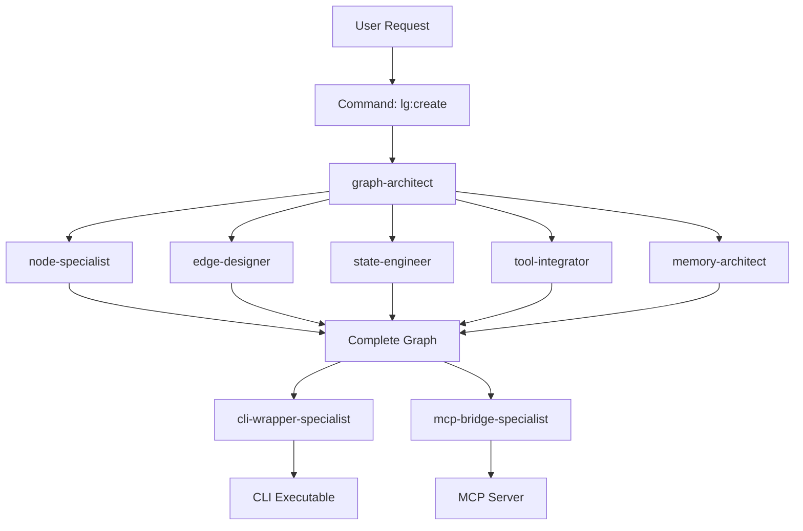

# LangGraph Architect Plugin

**Expert LangGraph/LangChain agent builder with MCP integration, workflow orchestration, and CLI accessibility.**

## Overview

The LangGraph Architect plugin is a comprehensive suite of tools for designing, building, and deploying production-ready AI agents using LangGraph. It provides 12 specialized agents, 8 powerful commands, and 6 reusable skills to create everything from simple ReAct agents to complex multi-agent orchestration systems.

### Key Features

- **12 Specialized Agents**: Expert agents for every aspect of LangGraph development
- **8 Commands**: Powerful CLI commands for creating and managing agents
- **6 Skills**: Reusable knowledge modules for common patterns
- **MCP Integration**: Consume MCP servers and expose agents as MCP tools
- **CLI Accessibility**: All agents are reachable via command line
- **Production-Ready**: Best practices built-in with testing, memory, and error handling

## Installation

### Prerequisites

- Python 3.11 or higher
- Claude Code CLI

### Install Plugin

```bash
# Install via Claude Code plugin manager
claude plugin install langgraph-architect

# Or install from repository
cd .claude/plugins
git clone https://github.com/Lobbi-Docs/claude.git
cd claude/.claude/plugins/langgraph-architect
```

### Install Python Dependencies

```bash
pip install langgraph>=0.2.0 langchain>=0.3.0 langchain-core>=0.3.0
```

## Quick Start

### Create Your First Agent

```bash
# Create a basic ReAct agent with memory
lg:create my-agent --type agent --pattern react --memory checkpoint --cli

# Create a multi-agent supervisor system
lg:create research-team --type multi-agent --pattern supervisor --memory sqlite --mcp

# Create an MCP server
lg:create tool-server --type agent --pattern tool-calling --mcp
```

### Use Presets

```bash
# Quick start with presets
lg:create my-agent --preset basic-agent
lg:create my-system --preset supervisor-system
lg:create my-swarm --preset swarm-agents
```

## Architecture

### Agent Hierarchy

```
graph-architect (Master Architect)
    ├── node-specialist (Node Implementation)
    ├── edge-designer (Routing Logic)
    ├── state-engineer (State Schema)
    ├── memory-architect (Persistence)
    ├── tool-integrator (Tool Setup)
    ├── subgraph-composer (Hierarchical Graphs)
    ├── orchestration-master (Multi-Agent Patterns)
    ├── mcp-bridge-specialist (MCP Integration)
    ├── context-engineer (Context Optimization)
    ├── cli-wrapper-specialist (CLI Wrappers)
    └── deployment-specialist (Production Deployment)
```

### Component Overview



## Agents

### Core Agents

#### 1. graph-architect
**Master architect for designing StateGraph structures**

- Designs overall graph topology
- Selects orchestration patterns
- Coordinates specialized agents
- Model: Sonnet

**When to use:**
- Starting a new LangGraph project
- Planning complex workflows
- Optimizing existing graphs

#### 2. node-specialist
**Expert in creating graph nodes with proper state handling**

- Implements individual nodes
- Handles state updates
- Integrates tools into nodes
- Model: Sonnet

**When to use:**
- Adding new nodes to graphs
- Implementing node logic
- Fixing node state issues

#### 3. edge-designer
**Specialist in conditional edges and routing logic**

- Implements routing functions
- Designs conditional logic
- Optimizes graph flow
- Model: Sonnet

**When to use:**
- Adding conditional routing
- Fixing routing bugs
- Optimizing decision points

#### 4. state-engineer
**Expert in TypedDict state schemas and reducers**

- Designs state schemas
- Implements custom reducers
- Optimizes state structure
- Model: Sonnet

**When to use:**
- Designing state schemas
- Adding state fields
- Implementing reducers

#### 5. memory-architect
**Specialist in checkpointing and persistence strategies**

- Configures checkpointing
- Implements semantic memory
- Optimizes storage
- Model: Sonnet

**When to use:**
- Adding persistence
- Implementing long-term memory
- Migrating storage backends

#### 6. tool-integrator
**Expert in tool creation and integration**

- Creates tool definitions
- Sets up ToolNode
- Integrates APIs
- Model: Sonnet

**When to use:**
- Adding tools to agents
- Integrating external APIs
- Fixing tool execution

### Advanced Agents

#### 7. subgraph-composer
**Specialist in hierarchical and modular graphs**

- Designs subgraph structures
- Implements nested agents
- Optimizes modularity
- Model: Sonnet

**When to use:**
- Creating modular systems
- Implementing hierarchies
- Reusing graph components

#### 8. orchestration-master
**Expert in multi-agent orchestration patterns**

- Implements supervisor pattern
- Designs swarm systems
- Optimizes collaboration
- Model: Opus

**When to use:**
- Creating multi-agent systems
- Implementing collaboration
- Optimizing agent handoffs

#### 9. mcp-bridge-specialist
**Expert in MCP integration**

- Consumes MCP servers
- Exposes agents as MCP tools
- Bridges protocols
- Model: Sonnet

**When to use:**
- Integrating MCP servers
- Exposing agents via MCP
- Building MCP bridges

#### 10. context-engineer
**Specialist in context window optimization**

- Implements message pruning
- Optimizes token usage
- Manages context windows
- Model: Sonnet

**When to use:**
- Reducing token costs
- Fixing context overflow
- Optimizing prompts

#### 11. cli-wrapper-specialist
**Expert in CLI accessibility**

- Creates CLI wrappers
- Implements argument parsing
- Optimizes UX
- Model: Sonnet

**When to use:**
- Adding CLI access
- Creating commands
- Improving CLI UX

#### 12. deployment-specialist
**Expert in production deployment**

- Deploys to LangGraph Cloud
- Configures production settings
- Optimizes for scale
- Model: Sonnet

**When to use:**
- Deploying to production
- Scaling agents
- Production configuration

## Commands

### lg:create
**Create new LangGraph projects with best practices**

```bash
# Basic usage
lg:create <name> [options]

# Options
--type <agent|workflow|multi-agent|subgraph>
--pattern <supervisor|swarm|pipeline|react|reflection>
--memory <none|checkpoint|sqlite|postgres|redis|mongodb>
--mcp              # Enable MCP server wrapper
--cli              # Generate CLI wrapper
--llm <provider>   # LLM provider
--tools <list>     # Built-in tools to include
--streaming        # Enable streaming
--tracing          # Enable LangSmith tracing

# Examples
lg:create my-agent --preset basic-agent
lg:create research-team --preset supervisor-system
```

### lg:agent
**Add agents to multi-agent systems**

```bash
# Add a new agent to existing system
lg:agent add <agent-name> --system <system-name> --role <role>

# Examples
lg:agent add researcher --system research-team --role "Web research specialist"
lg:agent add writer --system content-team --role "Technical writer"
```

### lg:node
**Add or modify nodes in graphs**

```bash
# Add a new node
lg:node add <node-name> --graph <graph-name> --type <type>

# Modify existing node
lg:node edit <node-name> --graph <graph-name>

# Examples
lg:node add validator --graph my-agent --type conditional
lg:node edit agent --graph my-agent
```

### lg:edge
**Add or modify edges in graphs**

```bash
# Add a new edge
lg:edge add --from <source> --to <target> --graph <graph-name>

# Add conditional edge
lg:edge add --from <source> --conditional --graph <graph-name>

# Examples
lg:edge add --from agent --to tools --graph my-agent
lg:edge add --from supervisor --conditional --graph research-team
```

### lg:memory
**Configure memory and persistence**

```bash
# Setup memory system
lg:memory setup <type> --graph <graph-name>

# Migrate memory backend
lg:memory migrate --from <old> --to <new> --graph <graph-name>

# Examples
lg:memory setup sqlite --graph my-agent
lg:memory migrate --from checkpoint --to postgres --graph my-agent
```

### lg:mcp
**MCP integration commands**

```bash
# Expose agent as MCP server
lg:mcp expose <agent-name>

# Connect to MCP server
lg:mcp connect <server-name> --to <agent-name>

# Examples
lg:mcp expose my-agent
lg:mcp connect filesystem --to my-agent
```

### lg:deploy
**Deploy agents to production**

```bash
# Deploy to LangGraph Cloud
lg:deploy <agent-name> --platform langgraph-cloud

# Deploy to custom infrastructure
lg:deploy <agent-name> --platform custom --config deploy.yaml

# Examples
lg:deploy my-agent --platform langgraph-cloud
lg:deploy research-team --platform docker
```

### lg:test
**Test agents and visualize graphs**

```bash
# Run tests
lg:test <agent-name>

# Visualize graph
lg:test <agent-name> --visualize

# Interactive testing
lg:test <agent-name> --interactive

# Examples
lg:test my-agent --visualize
lg:test research-team --interactive
```

## Skills

### 1. graph-patterns
**Common graph topology patterns**

- ReAct loop
- Supervisor pattern
- Swarm collaboration
- Pipeline workflows
- Map-reduce patterns

### 2. state-design
**State schema design patterns**

- Message-based state
- Task-based state
- Research state
- Custom reducers
- State optimization

### 3. memory-systems
**Memory and persistence patterns**

- Checkpointing strategies
- Semantic memory
- Short-term memory
- Long-term storage
- Vector stores

### 4. orchestration-patterns
**Multi-agent orchestration**

- Supervisor pattern
- Swarm pattern
- Hierarchical teams
- Parallel execution
- Agent handoffs

### 5. mcp-integration
**MCP server integration**

- Consuming MCP tools
- Exposing MCP endpoints
- Protocol bridging
- Error handling
- Authentication

### 6. context-engineering
**Context optimization**

- Token-based pruning
- Summarization strategies
- Importance scoring
- Context windows
- Prompt optimization

## Examples

### Example Templates

The plugin includes production-ready templates in `lib/templates/`:

- **react-agent.py**: Complete ReAct agent with tools and checkpointing
- **supervisor-multi-agent.py**: Multi-agent supervisor pattern
- **mcp-server-agent.py**: Agent exposed as MCP server
- **cli-agent.py**: CLI-accessible agent with Click

### Example Projects

Complete example projects in `lib/examples/`:

#### research-assistant/
Full-featured research assistant with:
- Multi-source research (web, papers)
- Semantic memory
- CLI and MCP interfaces
- Production-ready error handling

**Files:**
```
research-assistant/
├── main.py              # Main graph definition
├── cli.py               # CLI wrapper
├── mcp_server.py        # MCP server
├── requirements.txt     # Dependencies
└── README.md            # Documentation
```

**Run:**
```bash
cd lib/examples/research-assistant
pip install -r requirements.txt
python cli.py "Research LangGraph capabilities"
```

## Usage Patterns

### Pattern 1: Simple ReAct Agent

```bash
# Create
lg:create chat-agent --preset basic-agent

# Test
cd chat-agent
pip install -e .
chat-agent "Hello, world!"
```

### Pattern 2: Multi-Agent System

```bash
# Create
lg:create team --preset supervisor-system

# Add agents
lg:agent add researcher --system team --role "Research specialist"
lg:agent add writer --system team --role "Content writer"

# Deploy
lg:deploy team --platform langgraph-cloud
```

### Pattern 3: MCP Server

```bash
# Create
lg:create tools --preset mcp-server

# Test MCP
mcp run tools
mcp call tools research_topic '{"topic": "AI"}'
```

### Pattern 4: CLI Tool

```bash
# Create with CLI
lg:create assistant --type agent --cli

# Use CLI
cd assistant
pip install -e .
assistant "Help me with this task"
assistant --interactive
```

## Best Practices

### State Design
- Use TypedDict for type safety
- Add annotations for reducers
- Keep state flat when possible
- Separate concerns (messages, context, metadata)

### Node Design
- Single responsibility per node
- Clear naming conventions
- Consistent return types
- Error handling in every node
- Logging for debugging

### Edge Design
- Explicit routing conditions
- Cover all routing paths
- Avoid deep nesting
- Document routing logic
- Always define END conditions

### Memory
- Always use checkpointing in production
- Unique thread_ids per session
- Prune old checkpoints
- Test checkpoint/resume

### Testing
- Unit test individual nodes
- Integration test full graphs
- Test all routing branches
- Test error handling
- Performance testing

## Contributing

### Adding New Agents

1. Create agent file in `agents/`
2. Add agent metadata to `plugin.json`
3. Document triggers and use cases
4. Add tests

### Adding New Commands

1. Create command file in `commands/`
2. Add command to `plugin.json`
3. Document usage and examples
4. Add to README

### Adding New Skills

1. Create skill file in `skills/`
2. Add skill to `plugin.json`
3. Document patterns and examples

## Troubleshooting

### Agent Not Creating
- Check Python version (3.11+)
- Verify plugin installation
- Check API keys in .env

### Graph Not Executing
- Check state schema
- Verify edge routing
- Check for infinite loops
- Enable debug logging

### Memory Not Working
- Check checkpointer setup
- Verify thread_id
- Check database connection
- Test with MemorySaver first

### Tools Not Calling
- Check tool definitions
- Verify tool binding
- Check LLM model
- Test tools individually

## Resources

### Documentation
- [LangGraph Docs](https://langchain-ai.github.io/langgraph/)
- [LangChain Docs](https://python.langchain.com/)
- [MCP Protocol](https://modelcontextprotocol.io/)

### Examples
- [LangGraph Examples](https://github.com/langchain-ai/langgraph/tree/main/examples)
- [Claude Code Examples](https://github.com/Lobbi-Docs/claude/tree/main/.claude/plugins/langgraph-architect/lib/examples)

### Community
- [LangChain Discord](https://discord.gg/langchain)
- [Claude Discord](https://discord.gg/anthropic)

## License

MIT License - See LICENSE file for details

## Author

**Brookside BI**
https://github.com/Lobbi-Docs/claude

## Support

- GitHub Issues: [Report bugs](https://github.com/Lobbi-Docs/claude/issues)
- Documentation: [Full docs](https://github.com/Lobbi-Docs/claude/tree/main/.claude/plugins/langgraph-architect)
- Discord: [Community support](https://discord.gg/langchain)

---

**Built with Claude Code | Powered by LangGraph**
