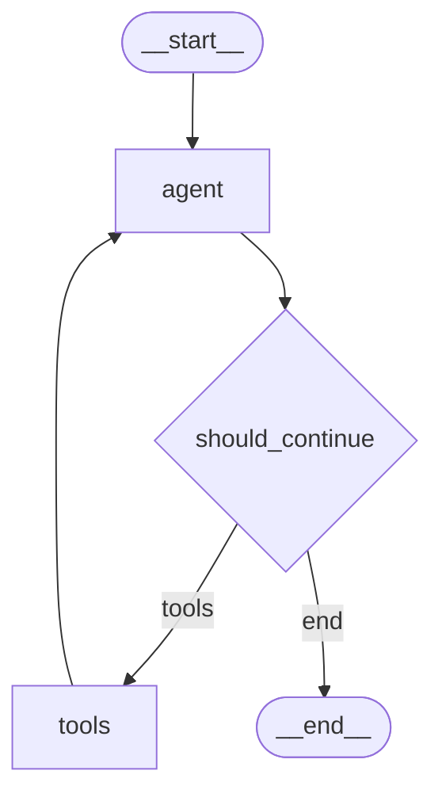

# lg:test - Testing and Debugging

Comprehensive testing, visualization, and debugging tools for LangGraph agents.

## Workflow Steps

### Run Tests

1. **Discover Tests**
   - Find test files
   - Parse test markers
   - Apply filters

2. **Setup Test Environment**
   - Initialize test database
   - Setup test fixtures
   - Configure mock services

3. **Execute Tests**
   - Run unit tests
   - Run integration tests
   - Collect results

4. **Generate Report**
   - Test results summary
   - Coverage report
   - Failed test details

### Visualize Graph

1. **Load Graph Definition**
   - Parse graph structure
   - Extract nodes and edges
   - Get node metadata

2. **Generate Visualization**
   - Create graph diagram
   - Add node labels
   - Show edge conditions
   - Highlight interrupts

3. **Export Visualization**
   - Save to file (PNG/SVG/Mermaid)
   - Display in terminal (ASCII)
   - Open in browser (interactive)

### Enable Tracing

1. **Configure LangSmith**
   - Setup API key
   - Configure project
   - Enable tracing

2. **Run Traced Execution**
   - Execute agent
   - Capture all steps
   - Record metrics

3. **Display Results**
   - Show trace URL
   - Print key metrics
   - Show execution path

### Debug Agent

1. **Load State**
   - Connect to checkpoint storage
   - Load thread state
   - Load specific checkpoint (if specified)

2. **Interactive Debug Session**
   - Display current state
   - Show execution history
   - Allow state inspection
   - Enable state modification

3. **Step Through Execution**
   - Execute single step
   - Inspect intermediate state
   - Modify and continue

## Testing Patterns

### Unit Tests
Test individual nodes and components.

```python
# tests/test_nodes.py
import pytest
from src.nodes.agent import agent_node
from src.state import State

def test_agent_node_basic():
    """Test agent node with basic input."""
    state = State(messages=[{"role": "user", "content": "Hello"}])

    result = agent_node(state)

    assert "messages" in result
    assert len(result["messages"]) > 0
    assert result["messages"][-1]["role"] == "assistant"

def test_agent_node_tool_calling():
    """Test agent node with tool calls."""
    state = State(
        messages=[{"role": "user", "content": "Search for LangGraph"}]
    )

    result = agent_node(state)

    # Check if tool was called
    last_message = result["messages"][-1]
    assert hasattr(last_message, "tool_calls")
    assert len(last_message.tool_calls) > 0

@pytest.mark.parametrize("input_msg,expected_tool", [
    ("Calculate 2+2", "calculator"),
    ("Search for Python", "search"),
    ("What time is it?", "get_time"),
])
def test_agent_tool_selection(input_msg, expected_tool):
    """Test agent selects correct tool."""
    state = State(messages=[{"role": "user", "content": input_msg}])
    result = agent_node(state)

    tool_calls = result["messages"][-1].tool_calls
    assert any(tc["name"] == expected_tool for tc in tool_calls)
```

### Integration Tests
Test full graph execution.

```python
# tests/test_graph.py
import pytest
from src.graph import app

@pytest.mark.integration
def test_graph_end_to_end():
    """Test full graph execution."""
    config = {"configurable": {"thread_id": "test_1"}}
    input_data = {"messages": [{"role": "user", "content": "Hello"}]}

    result = app.invoke(input_data, config)

    assert "messages" in result
    assert len(result["messages"]) > 1
    # Should have user message and assistant response
    assert result["messages"][0]["role"] == "user"
    assert result["messages"][-1]["role"] == "assistant"

@pytest.mark.integration
def test_graph_with_tools():
    """Test graph execution with tool use."""
    config = {"configurable": {"thread_id": "test_2"}}
    input_data = {
        "messages": [{"role": "user", "content": "Calculate 15 * 23"}]
    }

    result = app.invoke(input_data, config)

    # Should have final answer
    assert "messages" in result
    assert "345" in result["messages"][-1]["content"]

@pytest.mark.integration
def test_graph_streaming():
    """Test streaming execution."""
    config = {"configurable": {"thread_id": "test_3"}}
    input_data = {"messages": [{"role": "user", "content": "Hello"}]}

    chunks = list(app.stream(input_data, config))

    assert len(chunks) > 0
    # Each chunk should have messages
    for chunk in chunks:
        assert "messages" in chunk or "__end__" in chunk
```

### Checkpoint Tests
Test state persistence.

```python
# tests/test_checkpoints.py
import pytest
from src.graph import app

def test_checkpoint_persistence():
    """Test state persists across invocations."""
    config = {"configurable": {"thread_id": "test_persist"}}

    # First invocation
    result1 = app.invoke(
        {"messages": [{"role": "user", "content": "My name is Alice"}]},
        config
    )

    # Second invocation - should remember context
    result2 = app.invoke(
        {"messages": [{"role": "user", "content": "What's my name?"}]},
        config
    )

    assert "Alice" in result2["messages"][-1]["content"]

def test_checkpoint_time_travel():
    """Test time-travel debugging."""
    config = {"configurable": {"thread_id": "test_travel"}}

    # Run agent multiple steps
    app.invoke({"messages": [{"role": "user", "content": "Start"}]}, config)
    app.invoke({"messages": [{"role": "user", "content": "Continue"}]}, config)

    # Get checkpoint history
    history = list(app.get_state_history(config))
    assert len(history) > 0

    # Load from earlier checkpoint
    earlier_checkpoint = history[-2]
    config_with_checkpoint = {
        "configurable": {
            "thread_id": "test_travel",
            "checkpoint_id": earlier_checkpoint.id
        }
    }

    state = app.get_state(config_with_checkpoint)
    assert state.values is not None
```

### Error Handling Tests
Test error conditions.

```python
# tests/test_errors.py
import pytest
from src.graph import app

def test_invalid_input():
    """Test handling of invalid input."""
    config = {"configurable": {"thread_id": "test_error"}}

    with pytest.raises(ValueError):
        app.invoke({"messages": []}, config)  # Empty messages

def test_tool_error_recovery():
    """Test recovery from tool errors."""
    config = {"configurable": {"thread_id": "test_tool_error"}}

    # This should trigger tool error but agent should handle it
    result = app.invoke(
        {"messages": [{"role": "user", "content": "Search for: " + "x" * 10000}]},
        config
    )

    # Should have error message but not crash
    assert "messages" in result
    assert "error" in result["messages"][-1]["content"].lower()

@pytest.mark.slow
def test_timeout_handling():
    """Test handling of timeouts."""
    import time

    def slow_node(state):
        time.sleep(10)  # Simulate slow operation
        return state

    # Test with timeout
    # Implementation depends on your timeout mechanism
    pass
```

## Visualization

### Graph Structure
```python
# Visualize graph structure
from IPython.display import Image, display

display(Image(app.get_graph().draw_mermaid_png()))
```

Output formats:
- **PNG**: Raster image
- **SVG**: Vector image (scalable)
- **Mermaid**: Text-based diagram format
- **ASCII**: Terminal-friendly

### Mermaid Diagram


### ASCII Visualization
```
┌─────────┐
│ START   │
└────┬────┘
     │
     ▼
┌─────────┐
│  agent  │
└────┬────┘
     │
     ▼
     ◇ should_continue?
    / \
   /   \
  /     \
tools   END
  │
  └─────► agent
```

## Examples

### Run All Tests
```bash
lg:test run --project ./my-agent
```

### Run Specific Test File
```bash
lg:test run tests/test_agent.py --project ./my-agent
```

### Run Tests with Filter
```bash
lg:test run --filter "integration" --project ./my-agent
```

### Run Tests with Verbose Output
```bash
lg:test run --verbose --project ./my-agent
```

### Generate Coverage Report
```bash
lg:test coverage --project ./my-agent --output coverage.html
```

### Visualize Graph (PNG)
```bash
lg:test visualize --project ./my-agent --output graph.png
```

### Visualize Graph (Mermaid)
```bash
lg:test visualize --project ./my-agent --format mermaid --output graph.md
```

### Visualize Graph (ASCII in Terminal)
```bash
lg:test visualize --project ./my-agent --format ascii
```

### Enable Tracing
```bash
lg:test trace --project ./my-agent --trace-url my-project
```

### Debug Specific Thread
```bash
lg:test debug \
  --project ./my-agent \
  --thread-id thread_123 \
  --interactive
```

### Debug from Checkpoint
```bash
lg:test debug \
  --project ./my-agent \
  --thread-id thread_123 \
  --checkpoint-id checkpoint_5 \
  --interactive
```

### Benchmark Agent
```bash
lg:test benchmark \
  --project ./my-agent \
  --iterations 100 \
  --concurrent 10
```

Output:
```
Benchmark Results:
  Total Requests: 100
  Concurrent: 10
  Success Rate: 99%
  Average Latency: 234ms
  P50 Latency: 210ms
  P95 Latency: 450ms
  P99 Latency: 670ms
  Throughput: 42.7 req/s
```

### Validate Graph Structure
```bash
lg:test validate --project ./my-agent
```

Output:
```
Graph Validation:
  ✓ All nodes defined
  ✓ No unreachable nodes
  ✓ All edges valid
  ✓ No circular dependencies (for non-conditional edges)
  ✓ State schema consistent
  ⚠ Warning: Node 'old_node' has no outgoing edges
```

## Interactive Debugging

### Debug Session
```python
# Start debug session
lg:test debug --project ./my-agent --thread-id thread_1 --interactive
```

Commands in debug mode:
```
> state               # Show current state
> history             # Show execution history
> step                # Execute one step
> continue            # Continue to end
> modify state.key value  # Modify state
> checkpoint          # Show current checkpoint
> breakpoint node_name    # Add breakpoint
> trace               # Show LangSmith trace
> quit                # Exit debug mode
```

Example session:
```
Debug Session: thread_1
Current Node: agent
Checkpoint: checkpoint_3

> state
{
  "messages": [
    {"role": "user", "content": "Hello"},
    {"role": "assistant", "content": "Hi! How can I help?"}
  ],
  "next": "tools"
}

> step
Executing: tools
Tool called: search("LangGraph")

> state
{
  "messages": [...],
  "tool_results": ["LangGraph is a framework..."]
}

> continue
Execution complete.
```

## LangSmith Integration

### Enable Tracing
```python
# Set environment variables
import os

os.environ["LANGCHAIN_TRACING_V2"] = "true"
os.environ["LANGCHAIN_API_KEY"] = "your-api-key"
os.environ["LANGCHAIN_PROJECT"] = "my-agent-dev"
```

### View Traces
```bash
# Run with tracing
lg:test trace --project ./my-agent

# Output:
# ✓ Tracing enabled
# Project: my-agent-dev
# Trace URL: https://smith.langchain.com/o/.../runs/...
```

### Trace Analysis
```python
from langsmith import Client

client = Client()

# Get run details
run = client.read_run(run_id)

print(f"Status: {run.status}")
print(f"Duration: {run.end_time - run.start_time}")
print(f"Tokens: {run.outputs.get('token_usage')}")

# Get child runs (tool calls, etc.)
children = list(client.list_runs(parent_run_id=run.id))
for child in children:
    print(f"  - {child.name}: {child.status}")
```

## Benchmarking

### Performance Test
```python
# tests/test_performance.py
import pytest
import time
from src.graph import app

@pytest.mark.benchmark
def test_agent_latency(benchmark):
    """Benchmark agent latency."""
    config = {"configurable": {"thread_id": "bench"}}
    input_data = {"messages": [{"role": "user", "content": "Hello"}]}

    result = benchmark(lambda: app.invoke(input_data, config))

    assert result is not None

@pytest.mark.benchmark
def test_throughput():
    """Test throughput under load."""
    import concurrent.futures

    def invoke_agent(i):
        config = {"configurable": {"thread_id": f"bench_{i}"}}
        return app.invoke(
            {"messages": [{"role": "user", "content": f"Request {i}"}]},
            config
        )

    start = time.time()

    with concurrent.futures.ThreadPoolExecutor(max_workers=10) as executor:
        results = list(executor.map(invoke_agent, range(100)))

    duration = time.time() - start
    throughput = len(results) / duration

    print(f"Throughput: {throughput:.2f} req/s")
    assert throughput > 10  # At least 10 req/s
```

## Test Configuration

### pytest.ini
```ini
[pytest]
testpaths = tests
python_files = test_*.py
python_classes = Test*
python_functions = test_*

markers =
    integration: Integration tests (select with '-m integration')
    slow: Slow tests (deselect with '-m "not slow"')
    benchmark: Benchmark tests (select with '-m benchmark')

# Coverage
addopts =
    --cov=src
    --cov-report=html
    --cov-report=term-missing
    --strict-markers
    -v

# LangSmith
env =
    LANGCHAIN_TRACING_V2=false  # Disable in tests by default
```

### conftest.py
```python
# tests/conftest.py
import pytest
from src.graph import app

@pytest.fixture
def test_app():
    """Provide test app instance."""
    return app

@pytest.fixture
def test_config():
    """Provide test configuration."""
    return {"configurable": {"thread_id": "test"}}

@pytest.fixture(autouse=True)
def cleanup_checkpoints():
    """Clean up test checkpoints after each test."""
    yield
    # Cleanup logic here

@pytest.fixture
def mock_llm():
    """Mock LLM for testing."""
    from unittest.mock import Mock
    return Mock()
```

## Generated Test Files

### Test Template
```python
# tests/test_agent.py
"""Tests for agent functionality."""
import pytest
from src.graph import app

def test_agent_basic_response(test_app, test_config):
    """Test basic agent response."""
    input_data = {"messages": [{"role": "user", "content": "Hello"}]}
    result = test_app.invoke(input_data, test_config)

    assert "messages" in result
    assert len(result["messages"]) > 1

@pytest.mark.integration
def test_agent_with_checkpoints(test_app):
    """Test agent with checkpoint persistence."""
    config = {"configurable": {"thread_id": "test_checkpoint"}}

    # First call
    result1 = test_app.invoke(
        {"messages": [{"role": "user", "content": "Remember: Alice"}]},
        config
    )

    # Second call
    result2 = test_app.invoke(
        {"messages": [{"role": "user", "content": "What should I remember?"}]},
        config
    )

    assert "Alice" in result2["messages"][-1]["content"]

@pytest.mark.slow
def test_agent_complex_task(test_app, test_config):
    """Test agent on complex multi-step task."""
    input_data = {
        "messages": [{
            "role": "user",
            "content": "Research LangGraph, then summarize key features"
        }]
    }

    result = test_app.invoke(input_data, test_config)

    # Should have used tools
    # Should have final summary
    assert "messages" in result
```

## Error Handling

- **No tests found**: Check test file naming and location
- **Import errors**: Check Python path and dependencies
- **Checkpoint connection failed**: Verify database configuration
- **Visualization failed**: Check graphviz installation
- **Trace connection failed**: Verify LangSmith API key

## Notes

- Run tests before deployment
- Use markers to organize test suites
- Mock external services in tests
- Test both success and failure paths
- Use fixtures for common setup
- Enable tracing for debugging
- Visualize graphs to understand structure
- Use interactive debugging for complex issues
- Benchmark performance regularly
- Validate graph structure after changes

## Related Commands

- `lg:create` - Create project with tests
- `lg:node add` - Add nodes (generates tests)
- `lg:agent add` - Add agents (generates tests)
- `lg:deploy` - Deploy (runs tests first)

## See Also

- Testing Guide: https://langchain-ai.github.io/langgraph/how-tos/testing/
- LangSmith: https://smith.langchain.com/
- Visualization: https://langchain-ai.github.io/langgraph/how-tos/visualization/
- Debugging: https://langchain-ai.github.io/langgraph/how-tos/human_in_the_loop/breakpoints/
